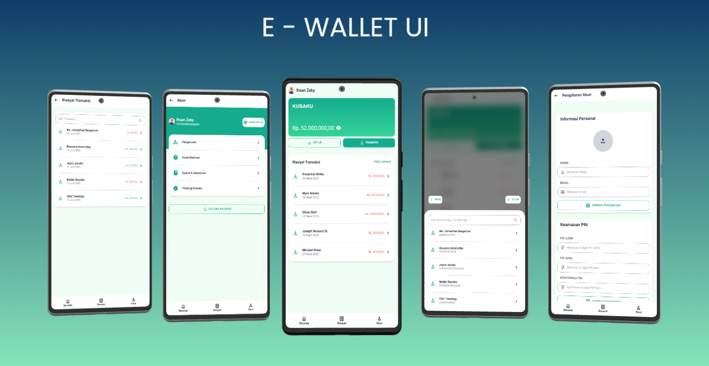

# 💳 E-Wallet UI

A modern, responsive UI for an e-wallet application built using **Tailwind CSS**. This project emphasizes clean design, utility-first styling, and ease of development with a live-reloading development server.

<p align="center">
  
</p>

---

## 🙌 About This Project

I'm currently learning front-end slicing and layout implementation by building a modern e-wallet UI from a design reference. This project is part of my self-study journey to improve my HTML, CSS (Tailwind), and responsive design skills.

📁 Explore more of my projects on GitHub:  
🔗 [https://github.com/ihsanzakyf](https://github.com/ihsanzakyf)

> Feedback, suggestions, or contributions are very welcome!

---

## ✨ Features

- ⚡ Utility-first CSS using [Tailwind CSS](https://tailwindcss.com/)
- 🔗 Icon support via [@egoist/tailwindcss-icons](https://github.com/egoist/tailwindcss-icons)
- 🔄 Live-reloading development server with [BrowserSync](https://browsersync.io/)
- 🧩 Concurrent task running using [Concurrently](https://www.npmjs.com/package/concurrently)
- 🧹 Code formatting with Prettier + Tailwind CSS plugin

---

## 🚀 Getting Started

### 1. Clone the Repository

```bash
git clone https://github.com/ihsanzakyf/e-wallet.git
cd e-wallet
```
